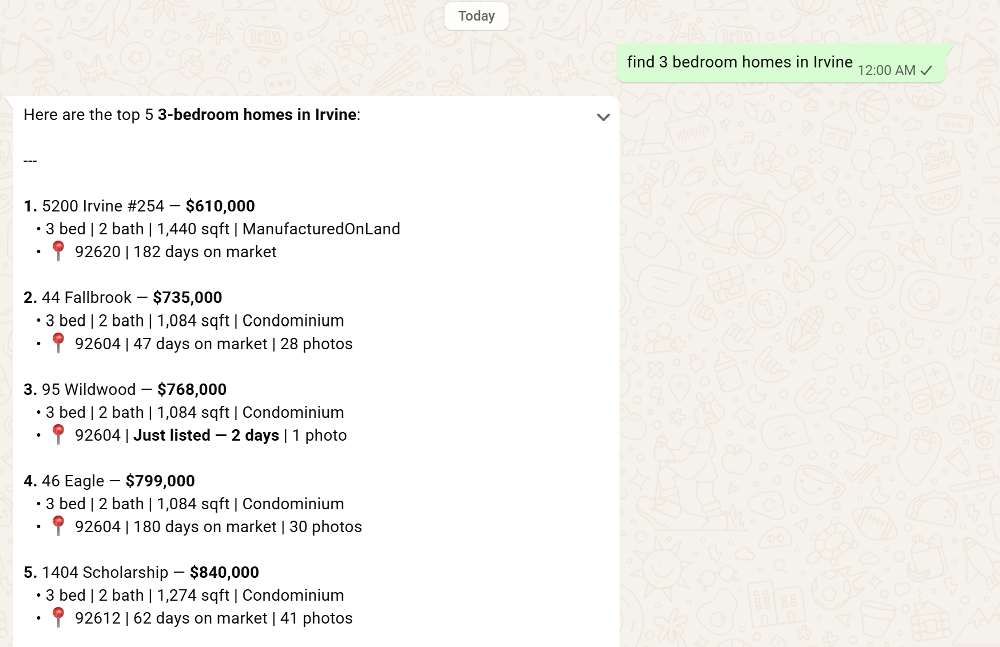
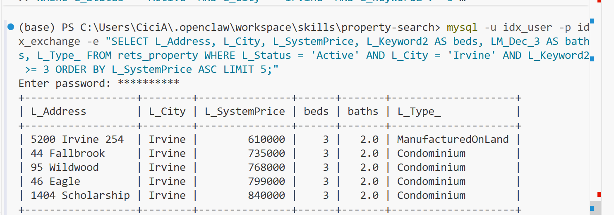

## Week 3 — NL Property Search + DB Integration
Files created, in ~/.openclaw/workspace/skills/property-search/:

scripts/db.ts — MySQL connection pool (mysql2/promise), generic parameterized query<T>() helper
scripts/parser.ts — parsePropertyQuery(), regex-based extraction of city/price/beds/baths/sqft/type/pool/view from free text
scripts/search.ts — searchActiveListings() and getSoldComps(), parameterized SQL against rets_property / california_sold
scripts/query.ts — the entrypoint that ties it together (parse → search → JSON output); this was the missing piece not specified in the original handbook code, needed because OpenClaw invokes skills via exec running a real process, not by calling TS functions directly
SKILL.md — corrected to real OpenClaw frontmatter (name/description only — an earlier draft had an invalid custom tools: JSON-schema block that isn't valid syntax)
package.json, tsconfig.json, .env — project scaffolding; run via tsx rather than a compiled dist/ build, for faster iteration

(gen) PS E:\intern\idxexchange\agent\openclaw> npx tsx .agents/skills/property-search/test-db.ts
🚀 Running Week 3 Database Pipeline Test...

1. Parsing input context: "Show me 3-bedroom condos in Irvine under $1.5M with a pool."

2. Executing parameters over rets_property database...
🎉 Found 0 active matching rows.
💡 (Tip: The strict AND filters yielded no matches. Try a broader search like 'Homes in Irvine' later!)

========================================

3. Fetching matching transactions from historical data...
🎉 Sourced 5 recent comps.

📊 Recent Historical Comps Data Found:
  [Comp #1]
  📍 Address: 25 Twiggs, Irvine
  💰 Closed Price: $3,180,000
  📅 Close Date:   2026-06-15
------------------------------
  [Comp #2]
  📍 Address: 118 Prospect, Irvine
  💰 Closed Price: $1,560,000
  📅 Close Date:   2026-06-15
------------------------------
  [Comp #3]
  📍 Address: 112 WALKING STICK, Irvine
  💰 Closed Price: $1,355,000
  📅 Close Date:   2026-06-15
------------------------------
  [Comp #4]
  📍 Address: 173 Cloudbreak, Irvine
  💰 Closed Price: $2,438,000
  📅 Close Date:   2026-06-15
------------------------------
  [Comp #5]
  📍 Address: 587 Rockefeller, Irvine
  💰 Closed Price: $1,225,000
  📅 Close Date:   2026-06-15
------------------------------
(gen) PS E:\intern\idxexchange\agent\openclaw> 

