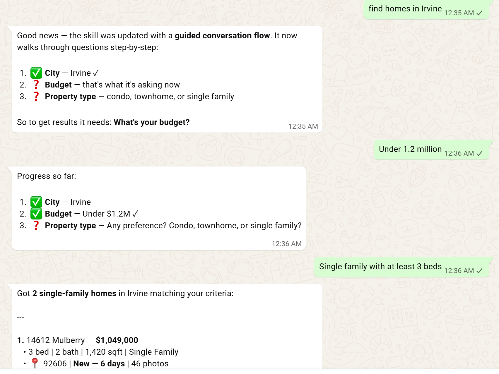

## Week 4 — Multi-turn Conversational Memory
Transform the single-turn query tool from Week 3 into a multi-turn conversational experience. 
The agent asks follow-up questions, remembers preferences within a session, and refines 
results iteratively. 

New file:
scripts/session.ts — session persistence, deliberately deviating from the handbook's in-memory Map. Reasoning: exec spawns a fresh Node process per message, so an in-memory Map would reset every turn. Replaced with a small JSON file (data/sessions.json) as the persistence layer, keyed by sender identifier, with the same getSession/updateSession/clearSession interface as the handbook's design.

Rewrote scripts/query.ts:
Accepts two arguments now: sender identifier + query text
Merges newly-parsed filters into the sender's saved session filters
Walks an ordered REQUIRED_STEPS list (city → budget → type) and asks about the first missing field only — this was a real iteration: an earlier version required only city, which let it skip straight to results instead of asking sequential follow-ups like the handbook's example conversation

Rewrote SKILL.md:
Initially tried $SENDER_ID/$USER_QUERY as if they were real substitution variables — they aren't (only {baseDir} is a documented OpenClaw substitution). Replaced with a concrete worked example (a realistic phone number + message) so the agent has a pattern to copy instead of an undefined variable to guess at.

Current state: multi-turn flow working — asks one follow-up question per turn in sequence, persists filters across separate WhatsApp messages from the same sender, returns filtered listings once all three required fields are collected.