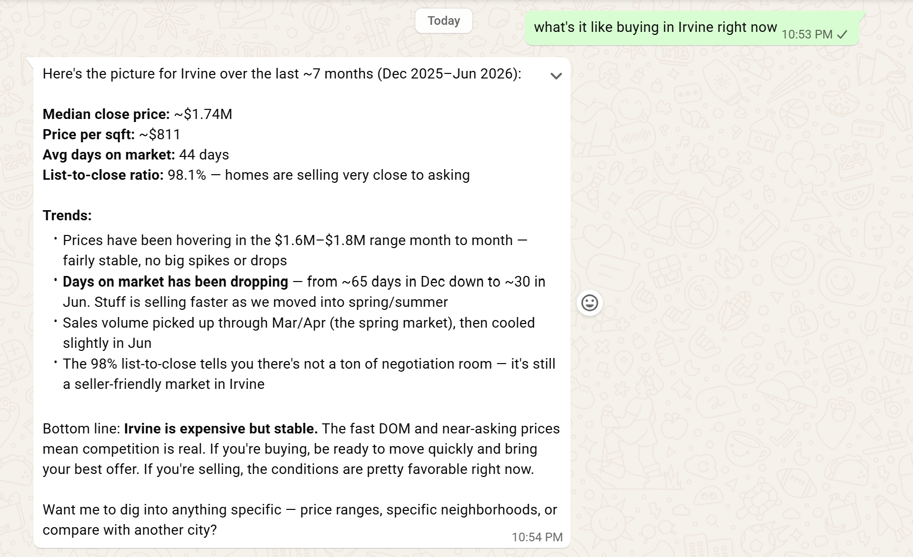
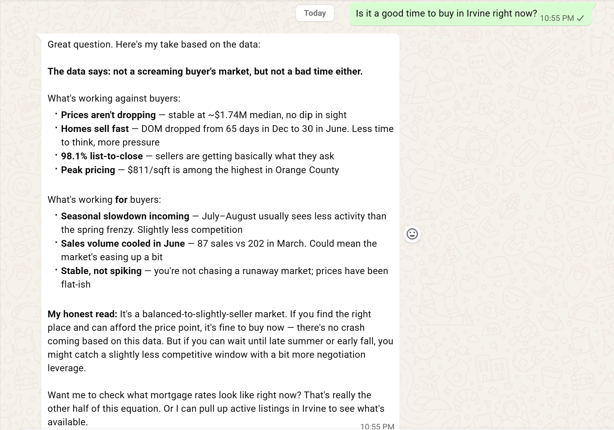

## Week 5 — Market Statistics Agent

Build a market analytics engine powered by `california_sold` — the 439K-record historical
comps table. The agent answers questions like "Is now a good time to buy in Irvine?" or
"What is the average price per sq ft in Pasadena?", including month-over-month price trends
when asked.

**New skill folder:** `skills/market-stats/` — kept separate from `property-search` rather
than added onto it, since it's a distinct, read-only capability with no session/follow-up
complexity, matching the handbook's own Week 9 design of treating `marketStatsAgent` as a
separate agent from `propertySearchAgent`.

New files:
- `scripts/db.ts` — MySQL connection pool, duplicated from `property-search` (each OpenClaw
  skill folder is self-contained; no shared `node_modules` across skills currently).
- `scripts/parseMarketQuery.ts` — extracts city, lookback window (months), and whether a
  trend was requested, from free text.
- `scripts/marketStats.ts` — `getCityMarketSummary()` (avg close price, price/sqft, avg DOM,
  list-to-close ratio) and `getPriceTrend()` (month-over-month breakdown), translated from
  the handbook's SQL. Kept in TypeScript rather than the handbook's Python/pandas version,
  to match the existing skill stack — Python is introduced deliberately in Week 6 for
  embeddings, not needed here.
- `scripts/query.ts` — entrypoint: parse → fetch summary (+ trend if requested) → JSON output.
- `SKILL.md` — describes when to trigger this skill vs. `property-search`, and how to
  interpret `list_to_close_pct` (near 100% = seller's market signal) for the agent's reply.

**Bug found & fixed:** the initial city-extraction regex (`[a-z\s]+?` matching to end of
string) silently failed to match at all on any query containing a number — e.g. "Irvine
over the last 24 months" — because the character class didn't allow digits and the pattern
required a clean match to the string's end. Fixed by adding explicit stop-words
(`over|during|for|since|the last`) and a digit/punctuation boundary to the lookahead, so the
city capture stops cleanly regardless of what follows it.

**Note on data types:** `mysql2` returns SQL `DECIMAL` columns (like `avg_dom`) as strings,
not numbers, by default — worth remembering if trend math is ever done on these fields
directly in TypeScript later.

**Current state:** working — returns real aggregate stats (sold count, avg close price,
price/sqft, avg days on market, list-to-close ratio) for a given city, and an optional
month-by-month trend array when the query implies one (e.g. "trend," "over the last N
months," "rising/falling").